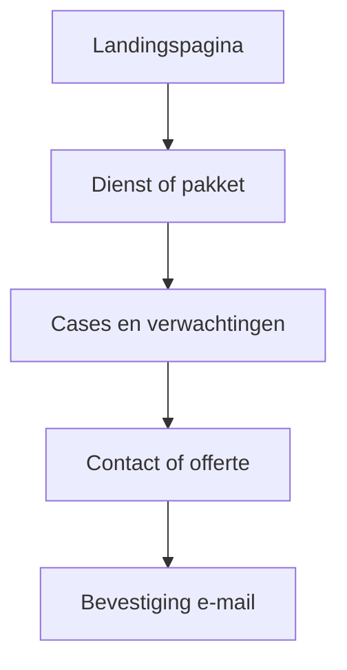

# VDB Digital Software — Complete 360° Repository- en Websiteaudit

## 1. Documentcontrole

| Veld | Waarde |
|------|--------|
| Auditdatum | 2026-07-23 |
| Tijdzone | Europe/Amsterdam (UTC+2) |
| Repositoryroot | `C:/Users/XXX/vdbdigital2.0` |
| Branch | `phase/shared-partner-backend` |
| HEAD | `a70a9212a8d1cae774635715d47740d11ad84ace` |
| Startstatus worktree | CLEAN (geen `git status --short` output) |
| Eindstatus worktree | CLEAN behalve dit auditbestand |
| Framework | Next.js `16.2.10` · React `19.2.4` |
| Package manager | npm (lockfile `package-lock.json` aanwezig) |
| Node/runtime | `v24.15.0` |
| Auditor | Cursor Agent |
| Bestandstatus | **Finaal op basis van uitgevoerde controles** — met expliciete NOT RUN-markeringen |
| Contractbaseline (verwacht) | `vdb-backend-contract@0.2.0-rc.1` / `2026.07.22.partner-rc1` |
| Contract in repo | Aanwezig op branch (`contracts/releases/…`, `docs/backend-contract.md`) |

**Waarschuwing:** VISUAL RUNTIME CHECK: NOT RUN (geen gecontroleerde browser/screenshotsessies per viewport). E2E Playwright: NOT RUN. Live `db reset` / partner-RPC runtime: NOT RUN (bewust, om lokale testdata niet te vernietigen). Publieke live-homepage: read-only GET vergeleken.

```
CHECKOUT ACTIVATION DECISION: NOT AUTHORIZED BY THIS AUDIT
REMOTE/PRODUCTION MUTATIONS: NOT PERFORMED
APPLICATION CHANGES: NOT PERFORMED
```

---

## 2. Managementsamenvatting

**Aantoonbaar sterk:** EN-primary i18n met NL-prefix; checkout fail-closed op UI + server; Tawk.to verwijderd en geblokkeerd; security headers in middleware; typecheck/build/access-control/security unit suites groen; partnerbackend RC1 lokaal bevroren op deze branch; cases expliciet gelabeld (Vermeulen/Grill Gasten live, TrustBooker coming soon).

**Blokkeert productie/groei:** vier bewezen P1 security-issues (staff IDOR quotes/invoices, documents scoping, invoice DEFINER grants, Mollie webhook token fail-open); checkout release-gate `NOT READY`; P05 operatorhints unset.

**Grootste security-/privacyrisico:** staff met `view_assigned` kan via service-role alle quotes/invoices zien zonder assignmentfilter (`admin-quotes.ts`).

**Grootste conversielek:** telefoonnummer alleen via env — zonder `NEXT_PUBLIC_COMPANY_PHONE` geen publiek belpad; meerdere CTA’s concurreren (intro + offerte + cases).

**Grootste SEO-probleem:** aliasroutes (`live-chat`/`livechat`, etc.) met eigen canonicals + incomplete sitemap t.o.v. solution-pagina’s.

**Grootste mobile/UX-probleem:** niet visueel gemeten; code toont body-scroll-lock en accordion-menu — focus-trap voor mobiel menu niet bewezen.

**Grootste content-/trustprobleem:** juridische pagina’s alleen in Engels; positionering “digitale infrastructuur & conversiegedreven webontwikkeling” deels aanwezig maar hero is breed “software/websites/automation”.

**Grootste architectuurrisico:** drie-repo-model correct gedocumenteerd, maar `next-intl` dependency ongebruikt terwijl custom i18n actief is; service-role bypass van RLS bij incomplete app-filters.

**Eerstvolgende veilige actie:** P1 staff-scope filters + Mollie webhook fail-closed wanneer token ontbreekt; checkout uit laten.

**Checkout:** moet uit blijven.

### Scorekaarten (0–100, rubric = bewijsdekking × risico)

| Domein | Score | Rubricbasis |
|--------|------:|-------------|
| Architectuur | 72 | Duidelijke lagen, maar service-role IDOR-risico |
| Functionele volledigheid | 78 | Marketing + portal + admin breed aanwezig |
| Content NL/EN | 70 | Goede message-files; legal EN-only |
| UX/IA | 74 | Heldere IA; CTA-druk; visual NOT RUN |
| Accessibility | 62 | Labels/skip aanwezig; WCAG runtime NOT RUN |
| SEO | 65 | hreflang/sitemap basis; aliases + gaten |
| Conversie | 68 | Sterke funnels; phone/env; checkout off |
| Security | 55 | Fail-closed checkout; 4× P1 open |
| Privacy/trust | 64 | Legal pages; JURIDISCHE REVIEW AANBEVOLEN |
| Performance | 60 | Build OK; CWV niet gemeten |
| DB/contract | 80 | Partner RC1 + exact-17 baseline gedocumenteerd |
| Ops/QA | 73 | Sterke scripts; e2e/visual NOT RUN |

---

## 3. Scope, grenzen en bewijsniveau

**In scope:** geopende repo `vdbdigital2` als `CANONICAL_BACKEND_OWNER`; marketing site; shop/checkout (fail-closed); auth; portal; admin; Supabase migrations; contract RC1; docs.

**Buiten scope mutaties:** siblingrepos Mobile/Partner; staging/productie; Mollie live; form submissions; commits/push.

**Bewijsniveaus:** Bewezen (code/commando/live GET) · Waarschijnlijk (codepatroon zonder runtime) · Hypothese (expliciet gelabeld).

---

## 4. Repositorysnapshot

| Item | Waarde |
|------|--------|
| Role | CANONICAL_BACKEND_OWNER / `vdbdigital2` |
| Router | App Router (`src/app`) |
| TypeScript | `typescript` ^5, `tsc --noEmit` PASS |
| Styling | Tailwind CSS 4 |
| DB | Supabase Postgres + migrations (geen Prisma ORM-client) |
| Auth | Supabase Auth + `admin_roles` / org membership |
| E-mail | Resend |
| Betalingen | Mollie (`@mollie/api-client`) — fail-closed |
| Analytics | Consent-categorieën in cookies-pagina; geen Tawk |
| i18n | Custom (`src/i18n/*`); `next-intl` in package.json maar **niet geïmporteerd in src** |
| Feature flags | `CHECKOUT_ENABLED`, booking/founding in `.env.example` |
| Local Supabase ports | 54320–54324, 54327 (`supabase/config.toml`) — komt overeen met verwachting |

---

## 5. Uitgevoerde en niet-uitgevoerde controles

| Controle | Status | Bewijs |
|----------|--------|--------|
| `git` preflight | PASS | HEAD `a70a921…`, clean start |
| `npm run typecheck` | PASS | exit 0 |
| `npm run lint` | PASS* | 0 errors, 1 warning unused var in generate-contract script |
| `npm run env:scan-secrets` | PASS | REAL_SECRET_MATCHES=0 (tracked) |
| `npm run catalog:verify-no-tawk` | PASS | RESULT PASS |
| `npm run checkout:release-gate` | FAIL (verwacht) | NOT READY — migration/operator hints |
| `npm run test:access-control` | PASS | 66 tests |
| `npm run test:security` | PASS | 75 tests |
| partner/catalog/tawk unit | PASS | vitest |
| `npm run build` | PASS | exit 0, routes geëmitteerd |
| Playwright e2e | NOT RUN | Geen browser-run in deze audit |
| Visual viewports | NOT RUN | Geen screenshotsessie |
| `supabase db reset` | NOT RUN | Bewust — destructief voor lokale data |
| `db:verify-partner-backend` | NOT RUN | Vereist verse DB-state; eerdere branch-PASS bestaat als documentatie, niet heruitgevoerd |
| Live GET `https://vdbdigital.nl` | PASS (read-only) | Homepage content matcht EN hero/packages |
| Dependency CVE audit (`npm audit`) | NOT RUN | Niet uitgevoerd (geen lockfilemutatie; geen claim op CVE’s) |

\*Lint warning is geen blocker voor build.

---

## 6. Architectuur- en systeemkaart

```text
Browser → Next.js middleware (headers + locale + session refresh)
       → App Router (marketing | shop | legal | auth | admin | portal)
       → Server Actions / repositories
       → Supabase (RLS + service-role server-only) / Resend / Mollie
```

**Positief:** `server-only` op gevoelige modules; Zod op form boundaries; deny-by-default permissions matrix; partnerdomein gescheiden van marketing `leads`.

**Risico:** middleware doet **geen** auth-guard (layouts wel); service-role omzeilt RLS wanneer app-filters ontbreken.

---

## 7. Volledige route-, API- en flow-inventaris

### 7.1 Publieke marketing (EN unprefixed; NL = `/nl…`)

| Route | Doel | Publiek | Databron | CTA | Index | Risico/status |
|-------|------|---------|----------|-----|-------|---------------|
| `/` | Homepage | Ja | i18n messages + commercial | Intro/solutions/quote | Ja | Sterk; meerdere CTA’s |
| `/solutions` (+ sub) | Diensten | Ja | solutions content | Contact/quote | Deels in sitemap | Aliasroutes |
| `/shop` | Pakketten & prijzen | Ja | catalog + pricing.ts | Intro/quote | Ja | Checkout off |
| `/cases`, `/cases/[slug]` | Cases | Ja | cases.ts + commercial | Case CTA | TrustBooker noindex | Labels OK |
| `/process` | Werkwijze | Ja | messages | Intro | Ja | — |
| `/about` | Over ons | Ja | messages | Contact | Ja | — |
| `/contact` | Contact | Ja | form-actions + Resend | Submit | Ja | Phone env |
| `/quote` | Offerte | Ja | form-actions | Submit | Ja | — |
| `/for-business` | B2B | Ja | content | Quote | Ja | — |
| `/support` | Support marketing | Ja | content | Contact | Ja | — |
| `/privacy` `/cookies` `/terms` `/refund-policy` | Legal | Ja | hardcoded EN | — | Ja | NL ontbreekt |

### 7.2 Shop / checkout

| Route | Status |
|-------|--------|
| `/cart` | Checkout-flag gated |
| `/checkout` | Redirect naar `/shop` wanneer flag off |
| `/checkout/success` `/cancelled` | Aanwezig |

### 7.3 Auth

`/inloggen`, `/account-aanmaken`, `/account-activeren`, `/e-mail-bevestigen`, `/wachtwoord-vergeten`, `/wachtwoord-herstellen`, `/geen-toegang`, `/uitnodiging/accepteren`, `/uitloggen`, `/auth/callback`

### 7.4 Portal / Admin

Portal: projecten, offertes, facturen, documenten, berichten, support, meldingen, profiel, beveiliging — layout `checkCustomerAccess`.

Admin: customers, projects, quotes, invoices, documents, products, categories, addons, orders, leads, users, roles, organizations, MFA — layout `checkAdminAccess` + permission matrix.

### 7.5 API

| Endpoint | Doel | Risico |
|----------|------|--------|
| `/api/webhooks/mollie` | Payment webhook | Token fail-open (PAY-001) |
| `/uitloggen` route | Logout | — |
| `/auth/callback` | OAuth/magic | — |

### 7.6 Alias / duplicate

| Canonical | Alias |
|-----------|-------|
| `/solutions/livechat` | `/solutions/live-chat` |
| `/solutions/reviewflows` | `/solutions/review-flows` |
| `/solutions/websites` | `/solutions/custom-websites` |

---

## 8. Contradictieregister

| ID | Bron A | Bron B | Conflict | Resolutievoorstel |
|----|--------|--------|----------|-------------------|
| C-001 | Baseline: telefoon `06 28600727` | Code: alleen `NEXT_PUBLIC_COMPANY_PHONE` | Nummer niet hardcoded; live hangt van env af | Env in alle omgevingen zetten of bewuste “geen telefoon” documenteren |
| C-002 | Positionering “digitale infrastructuur & conversiegedreven webontwikkeling” | Hero: “Custom software, websites and automation…” | Soft mismatch | Hero/subcopy aanscherpen zonder claimverlies |
| C-003 | `next-intl` in package.json | Geen imports in `src/` | Dode dependency | Verwijderen in aparte cleanup-PR of adopteren |
| C-004 | Contract freeze `0.1.0` / partner RC `0.2.0-rc.1` | Live prod exact-17 zonder partner | Verwacht | Partner niet op prod tot nieuwe apply |
| C-005 | Forensic audit 2026-07-21 P1 | Huidige code | P1’s nog aanwezig | Nog niet gefixt |
| C-006 | Legal pages EN | NL locale marketing | NL-bezoeker krijgt EN legal | NL legal vertalen of locale-aware |
| C-007 | Pakketten 4 niveaus bevestigd | Code Onepage/Launch/Growth/Custom | Align | Behouden |
| C-008 | Checkout “uit” | `/checkout` route bestaat | Fail-closed redirect — OK | Geen activatie |

---

## 9. P0 — Kritieke blokkades

**Geen P0 bewezen** zolang `CHECKOUT_ENABLED !== "true"`.

Forensische register claimt eveneens P0=0 onder checkout-off — herbevestigd.

---

## 10. P1 — Hoge prioriteit

### SEC-001 — Staff quote IDOR / ontbrekende assignment-scope
- **Ernst:** P1 · **Zekerheid:** Bewezen · **Status:** Open
- **Scope:** Admin quotes
- **Bewijs:** `src/server/repositories/admin-quotes.ts` regels 14–39 en 67–86: permission check staat `quotes.view_assigned` toe, query filtert niet op assignee; gebruikt `createServiceRoleClient()`.
- **Impact:** Staff met beperkte rol kan alle organisatiequotes zien.
- **Oplossing:** Bij alleen `view_assigned`: filter op assignment/org-scope; unit + RLS/integration test.
- **Acceptatie:** Gebruiker A ziet geen quote van org B zonder assignment.
- **Verificatie:** `npm run test:access-control` + nieuwe repository-test.

### SEC-002 — Staff invoice IDOR (zelfde patroon)
- **Ernst:** P1 · Bewezen · Open
- **Bewijs:** `src/server/repositories/admin-invoices.ts` (zelfde `view_assigned` zonder filter; contrast: `admin-projects.ts` filtert wél).
- **Acceptatie/verificatie:** analoog SEC-001.

### SEC-003 — Admin documents niet org-geforceerd
- **Ernst:** P1 · Bewezen · Open
- **Bewijs:** `admin-documents.ts` — `view_organization` toegestaan; select unscoped tenzij caller filter meegeeft.
- **Impact:** Cross-tenant documentmetadata/-toegang voor staff.

### SEC-004 / PAY-001 — Mollie webhook token fail-open
- **Ernst:** P1 · Bewezen · Open
- **Bewijs:** `src/lib/payments/webhook-url.ts` 55–58: als geen expected token → `{ valid: true }`. Test documenteert dit: `tests/unit/mollie-webhook.test.ts`.
- **Impact:** Ongeauthenticeerde webhook calls wanneer token niet geconfigureerd (mitigatie: checkout off + bedragchecks).
- **Oplossing:** In productie fail-closed zonder token; of verplicht token in env-validatie.

### PAY-002 — Checkout release-gate NOT READY
- **Ernst:** P1 (activatieblokkade) · Bewezen
- **Bewijs:** `npm run checkout:release-gate` → FAIL migration_applied, limiter, mollie_test_verified, legal_fixed_sku.
- **Impact:** Mag niet op `CHECKOUT_ENABLED=true` — gate correct.

---

## 11. P2 — Middelgrote verbeteringen

| ID | Onderwerp | Bewijs | Impact |
|----|-----------|--------|--------|
| SEO-001 | Aliasroutes met eigen canonicals | `live-chat/page.tsx`, build output beide routes | Duplicate content risico |
| SEO-002 | Sitemap mist meerdere solutions | `sitemap.ts` staticRoutes vs build routes | Crawl gaps |
| COPY-001 | Legal pages alleen EN | `(legal)/*/page.tsx` | NL UX/trust |
| UX-001 | Phone alleen via env | `site.ts`, contact page | Conversiefrictie |
| ARCH-001 | Unused `next-intl` | package.json vs geen imports | Onderhoud |
| SEC-005 | Rate-limit fail-open non-checkout | `rate-limit.ts` ~169–176 | Spam/contact abuse |
| A11Y-001 | Mobiel menu focus-trap niet bewezen | `header.tsx` scroll-lock wel | WCAG 2.2 keyboard |
| PERF-001 | CWV niet gemeten | NOT RUN | Onbekende LCP/INP |
| DB-001 | Partner RC1 nog niet op productie | by design | Staging eerst |
| CONV-001 | Meerdere hero-CTA’s | `home.*` CTAs | Beslissingsfrictie |

---

## 12. P3 — Polish en optimalisatie

| ID | Onderwerp |
|----|-----------|
| P3-001 | Lint warning unused `ROOT` in `generate-contract-rc1-bundle.ts` |
| P3-002 | Portal dual paths `deliverables` / `opleveringen` |
| P3-003 | Admin label-mix NL/EN in UI |
| P3-004 | CSP bevat `unsafe-inline` (hardening) |
| P3-005 | Microcopy “→” in CTA’s consistent maken |

---

## 13. Structuur en informatiearchitectuur

**Sterk:** Scheiding Solutions / Packages / Cases / Process / About / Contact; shop als “Packages & pricing”; TrustBooker gelabeld coming soon; demos gelabeld.

**Verbeter:** Diensten vs pakketten vs softwareproducten scherper in hero; legal onder NL; telefoon consistent.

Nieuwe bezoeker begrijpt binnen seconden *wat* (software/websites/automation) — *voor wie* en *prijsverwachting* volgen na scroll naar packages (live bevestigd).

---

## 14. Route-voor-route UX-audit

| Route | Loading/empty/error | CTA | Notitie |
|-------|---------------------|-----|---------|
| `/` | common error strings | 3–4 CTA’s | Overvolle first decision |
| `/shop` | filters + sr-only search | Intro per package | Checkout hidden |
| `/contact` | form success/error | Send | Phone conditional |
| `/quote` | form states | Submit | Rate limited |
| `/cases/[slug]` | typed pages | Live/external | TrustBooker noindex |
| `/inloggen` | auth errors | Login | Dutch path, EN-primary locale system |
| `/portal/*` | protected layout | Portal nav | Server gate |
| `/admin/*` | MFA + permissions | Admin shell | Server gate |
| `/checkout` | redirect | — | Fail-closed |

VISUAL RUNTIME CHECK: NOT RUN — geen viewport-PASS geclaimd.

---

## 15. Mobile- en responsive-audit

**Codebewijs:** `header.tsx` — mobile accordion, `useLockBody`, aria-expanded; Tailwind responsive classes wijdverspreid.

**Viewports 360–1920:** NOT RUN visueel.

**Risico’s (waarschijnlijk):** sticky header vs CTA above-the-fold; pricing cards stacking; admin tables op small screens.

---

## 16. WCAG 2.2 AA-audit

| Criterium | Status | Bewijs |
|-----------|--------|--------|
| Skip link | Bewezen aanwezig (copy) | `nav.skipToContent` in messages |
| Form labels / aria-invalid | Bewezen in UI primitives | `input.tsx`, `textarea.tsx` |
| FAQ aria-expanded | Bewezen | `faq-section.tsx` |
| Brand aria-label | Bewezen | `BrandLink.tsx` |
| Focus visible / 200% zoom / reflow | NOT RUN | — |
| Contrast champagne/goud op zwart | Waarschijnlijk OK; niet gemeten | Design tokens |
| Dialog focus trap (mobile nav) | Waarschijnlijk gap | Geen trap gevonden |

Bevindingen: A11Y-001 (P2).

---

## 17. Nederlandse en Engelse contentaudit

**EN:** Primair, natuurlijk, professioneel; weinig AI-cliché in hero; cases eerlijk gelabeld.

**NL:** Message-files parallel (`nl.ts`); natuurlijke aanspreekvorm “je/jouw”; “Reviewflows”/`Livechat` als samenstellingen OK.

**Gaps:** Legal EN-only; auth routes Nederlandse paden (consistent voor NL-users); TrustBooker “binnenkort” bewust.

**Geen verzonnen reviews/omzet** in aangetroffen homepage/cases — positief (live + code).

---

## 18. Complete copyverbeteringsmatrix

### Homepage

| Element | Huidig (EN) | Probleem | Nieuwe EN | Nieuwe NL | Reden |
|---------|-------------|----------|-----------|-----------|-------|
| SEO title | VDB Digital Software — Software built around your business | Breed | VDB Digital Software \| Conversion-led websites & digital systems | VDB Digital Software \| Conversiegerichte websites & digitale systemen | Zoekintentie + positionering |
| Meta | builds fast, scalable digital systems… | OK, iets generiek | Builds conversion-led websites, webshops and automation for Dutch and international SMEs. | Bouwt conversiegerichte websites, webshops en automatisering voor MKB in NL en daarbuiten. | Specifieker |
| H1 | Custom software, websites and automation built around your business. | Soft vs “digitale infrastructuur” | Websites and digital systems that turn visitors into enquiries. | Websites en digitale systemen die bezoekers omzetten in aanvragen. | Conversiehelder |
| Hero sub | builds fast, scalable… | OK | From clear websites to WhatsApp AI and maintenance — scoped after a short introduction. | Van heldere websites tot WhatsApp AI en onderhoud — afgestemd na een korte kennismaking. | Verwachting |
| Primary CTA | Schedule an introduction | Sterk | Schedule an introduction | Plan een kennismaking | Behouden |
| Secondary CTA | View our solutions / Request a proposal | Drie CTA’s | Request a proposal (secundair); solutions tertiary text link | Vraag een voorstel aan | Minder concurrentie |
| Trust | Cases labeled | Sterk | Keep labels | Labels behouden | Geen nepclaims |

### Diensten `/solutions`

| Element | Voorstel EN | Voorstel NL |
|---------|-------------|-------------|
| H1 | Solutions that remove digital friction | Oplossingen die digitale frictie wegnemen |
| CTA | Schedule an introduction | Plan een kennismaking |

### Pakketten `/shop`

| Element | Voorstel |
|---------|----------|
| H1 EN | Four website levels — scoped after introduction |
| H1 NL | Vier websiteniveaus — na kennismaking scherp afgebakend |
| Trust | One language included; extra languages are paid add-ons (al aanwezig — behouden) |
| FAQ | What is included in copy help? / Wat zit er in teksthulp? — antwoord: verschilt per pakket, vastgelegd in offerte |

### Cases

Behoud huidige eerlijke labeling. TrustBooker: “in ontwikkeling / coming soon” — niet als klantcase.

### Over ons / Process / Contact

| Route | H1 EN | H1 NL | Primary CTA |
|-------|-------|-------|-------------|
| About | Built by VDB Digital Software | Gebouwd door VDB Digital Software | Contact |
| Process | From introduction to growth | Van kennismaking tot groei | Schedule introduction |
| Contact | Tell us what you need | Vertel wat je nodig hebt | Send |

### Login

| Element | EN | NL |
|---------|----|----|
| Title | Client login | Klantlogin |
| Help | Use the email linked to your organisation account | Gebruik het e-mailadres van je organisatieaccount |

*Geen prijzen/termijnen verzonnen buiten bestaande catalogus (€995 / €1695 / €2995 / custom quote).*

---

## 19. SEO- en indexatieaudit

| Route | Index? | Canonical | Hreflang | Probleem | Aanbeveling |
|-------|--------|-----------|----------|----------|-------------|
| `/` | Ja | EN primary | en/nl/x-default | — | Behouden |
| Solutions aliases | Ja | Per alias pad | — | SEO-001 | 308 naar canonical |
| `/shop` | Ja | OK | OK | — | — |
| TrustBooker case | noindex | — | — | Bewust | Behouden |
| `/admin/*` `/portal/*` | noindex/disallow | — | — | robots + layout | Behouden |
| Ontbrekende solutions in sitemap | Deels | — | — | SEO-002 | Toevoegen |

`robots.ts`: preview disallow all; prod disallow `/admin/`, `/api/`, `/checkout/` — goed. **Autorisatie ≠ robots.**

Structured data: niet volledig geïnventariseerd als JSON-LD overal — status **deels / NOT fully verified**.

---

## 20. Conversie- en funnelanalyse



| Funnel | Stappen | Blocker | Analytics-event (voorstel) |
|--------|---------|---------|----------------------------|
| Bezoeker→contact | Home/CTA→contact→submit | Phone env; rate-limit | `contact_submit_success` |
| Bezoeker→offerte | quote form | Spam/rate-limit | `quote_submit_success` |
| Bezoeker→pakket | shop→intro | Checkout off (bewust) | `package_view`, `checkout_blocked` |
| Bezoeker→account | register/login | — | `account_start` |
| Login | inloggen | — | `login_success/failure` (geen PII) |
| Portal | layout gate | Auth | `portal_action` |
| Admin | MFA+perms | SEC-001–003 | — |
| Partner | backend RC1; geen UI in deze repo | Sibling | — |

**Checkout blocked event** is verplicht zolang flag off.

---

## 21. Merk-, design- en assetaudit

- Merknaam in messages: **VDB Digital Software** — consistent.
- Logo: `BrandLink` + brand assets (niet opnieuw ontworpen in deze audit).
- Champagne/goud + zwart/wit: design tokens in Tailwind — light marketing tokens kunnen naast dark admin bestaan (waarschijnlijk bewust).
- Favicon/OG: root metadata in `layout.tsx`.
- Geen Tawk-widget — bevestigd.

---

## 22. Vertrouwen, transparantie en juridische aandachtspunten

| Onderwerp | Status |
|-----------|--------|
| Cases labeling | Sterk |
| Privacy/cookies/terms/refund | Aanwezig, EN |
| B2B-primary terms | Aanwezig |
| Telefoonconsistentie | C-001 |
| Reviews/omzetclaims | Niet aangetroffen als nep |
| TrustBooker scheiding | Correct |
| Checkout legal SKU | Gate FAIL legal_fixed_sku |

**JURIDISCHE REVIEW AANBEVOLEN** voor: B2C-prijzen/herroeping, FIXED SKU-goedkeuring, NL-vertaling legal, consent analytics.

---

## 23. Formulier-, e-mail- en notificatieaudit

| Form | Validatie | Rate limit | E-mail | Risico |
|------|-----------|------------|--------|--------|
| Contact | Zod + honeypot | 5/window; fail-open zonder backend | Resend | SEC-005 |
| Quote | Zod | 3/window | Resend | SEC-005 |
| Support | Similar patterns | — | — | — |

Geen echte verzending uitgevoerd. Auth-mailtemplates: documentatie aanwezig (`PRODUCTION_AUTH_EMAIL_TEMPLATE_PACK.md`) — runtime niet getest.

---

## 24. Authenticatie-, rollen- en portalaudit

| Laag | Beoordeling |
|------|-------------|
| Middleware | Session refresh only — geen route ACL |
| Admin layout | `checkAdminAccess` + MFA AAL2 voor sensitive |
| Portal layout | `checkCustomerAccess` |
| Permissions | Deny-by-default matrix |
| Partner roles | `partner_profiles.status` op RC1 branch |
| Klantregel | Verborgen knop ≠ autorisatie — layouts server-side: OK; staff IDOR: niet OK |

---

## 25. Database-, Supabase-, RLS- en contractaudit

| Item | Status |
|------|--------|
| Exact-17 baseline eindigt `20260719170000` | Gedocumenteerd |
| Partner migrations 20260722100000–170000 | 8 bestanden aanwezig |
| Contract bundle `0.2.0-rc.1` | Aanwezig |
| Tag `shared-partner-backend-rc1` | Lokaal (eerdere freeze) |
| Storage 6 buckets | Geen 7e marketing-assets |
| RLS partner | In migrations; runtime verify NOT RUN deze sessie |
| Marketing `leads` ≠ partner_leads | Correct gescheiden |

**BCP-009/011:** deferred non-blocking (gedocumenteerd).

---

## 26. Catalogus-, pakket- en eligibilityaudit

- Bron: `pricing.ts` (centen) + commercial content + DB catalog admin.
- Vier niveaus: Onepage / Launch / Growth / Custom — align met baseline.
- `legalStatus` / B2C approval gates in pricing types.
- Tawk legacy blocklist enforced in repositories/actions.
- Checkout eligibility fail-closed wanneer flag off.
- **Geen prijswijziging in deze audit.**

---

## 27. Checkout- en financiële veiligheidsaudit

| Control | Resultaat |
|---------|-----------|
| Flag default off | Bewezen `features.ts` |
| Page redirect | Bewezen `checkout/page.tsx` |
| Server action gate | Bewezen `checkout-actions.ts` |
| Cart service gate | Bewezen |
| Release gate | NOT READY |
| Webhook token | Fail-open (PAY-001) |
| Partner ledger/payouts | Schema op branch; niet op prod |

```
CHECKOUT ACTIVATION DECISION: NOT AUTHORIZED BY THIS AUDIT
```

---

## 28. Security- en privacyaudit

### OWASP-georiënteerd

| Thema | Bewezen | Hardening |
|-------|---------|-----------|
| Broken access control | SEC-001–003 | Assignment/org filters |
| Webhook auth | PAY-001 | Fail-closed token |
| XSS | sanitize-html allowlist aanwezig | CSP unsafe-inline |
| Secrets | scan PASS | Geen waarden in dit rapport |
| Headers | middleware CSP/HSTS/XFO | — |
| IDOR | Staff financial docs | — |
| SSRF/upload | Storage deny authenticated | — |

Geen exploitatie uitgevoerd. Service-role niet in browserclient.

---

## 29. Performance- en Core Web Vitals-audit

- Build PASS; middleware proxy aanwezig.
- `next/font` / image usage: niet diep gemeten.
- **Geen Lighthouse-cijfers** — label kwalitatief only.
- Hypothese: hero visuals + case previews beïnvloeden LCP — meten in Fase 3.

---

## 30. Analytics-, consent- en meetplan

Cookies-pagina documenteert categorieën; geen Tawk. Consent-before-marketing tracking: codepad niet volledig runtime-geverifieerd.

### Aanbevolen eventmatrix (NIET TOEGEPAST)

| Event | Trigger | Consent |
|-------|---------|---------|
| `cta_click` | Header/hero CTA | functional/analytics |
| `package_view` | Shop package | analytics |
| `case_view` | Case page | analytics |
| `contact_start` / `contact_validation_error` / `contact_success` | Form | analytics |
| `quote_submit_success` | Quote | analytics |
| `checkout_blocked` | Checkout wanneer flag off | analytics |
| `login_success` / `login_failure` | Auth (geen e-mail in props) | necessary/analytics |
| `portal_core_action` | Portal | necessary |

---

## 31. Betrouwbaarheid, logging en operations

- Error/not-found/loading patterns in App Router aanwezig.
- Audit scripts: `audit:supabase-*`, verify-* scripts.
- Backup/restore: alleen documentatie — **geen recente restoretest bewezen** → niet claimen.
- Staging project: NOT CREATED (RC freeze klaar).
- Productie apply partner: NOT AUTHORIZED.

---

## 32. Testdekking en quality gates

| Suite | Resultaat |
|-------|-----------|
| typecheck | PASS |
| lint | PASS (1 warning) |
| access-control | PASS 66 |
| security | PASS 75 |
| partner/catalog/tawk hygiene | PASS |
| build | PASS |
| checkout gate | FAIL (intended blocker) |
| e2e | NOT RUN |
| visual | NOT RUN |

---

## 33. Concrete codevoorbeelden — niet toegepast

### SEC-001 — assignment filter (VOORBEELD — NIET TOEGEPAST)

Doelbestand: `src/server/repositories/admin-quotes.ts`

```ts
// VOORBEELD — NIET TOEGEPAST
// Na permission check: beperk view_assigned tot toegewezen orgs/projecten.
const canViewAll =
  hasPermission(ctx.role, "quotes.view_all") ||
  hasPermission(ctx.role, "quotes.manage");

let query = supabase.from("portal_quotes").select(/* ... */);

if (!canViewAll) {
  // Vereist: aantoonbare assignment-tabel of project_members-koppeling.
  // Vervang door het werkelijke assignment-veld uit jullie schema.
  query = query.in("organization_id", await listAssignedOrganizationIds(ctx.userId));
}
```

Verificatie later: unit test met twee orgs + rol SUPPORT zonder view_all.

### PAY-001 — webhook fail-closed (VOORBEELD — NIET TOEGEPAST)

Doelbestand: `src/lib/payments/webhook-url.ts`

```ts
// VOORBEELD — NIET TOEGEPAST
export function verifyMollieWebhookToken(
  providedToken: string | null,
): { valid: true } | { valid: false; reason: "missing" | "invalid" | "unconfigured" } {
  const expected = getMollieWebhookToken();
  if (!expected) {
    // Productie: fail closed. Lokale dev mag expliciete bypass-env gebruiken.
    if (process.env.MOLLIE_WEBHOOK_ALLOW_UNTOKENED === "true" && process.env.NODE_ENV !== "production") {
      return { valid: true };
    }
    return { valid: false, reason: "unconfigured" };
  }
  // ... timingSafeCompare zoals nu
}
```

Test: pas `tests/unit/mollie-webhook.test.ts` aan zodat unconfigured ≠ valid in production-mode.

---

## 34. Geprioriteerd implementatieplan

### Fase 0 — Veiligheidsblokkades
| Volgorde | ID | Taak | Impact | Inspanning | Risico |
|----------|----|------|--------|------------|--------|
| 1 | SEC-001/002 | Assignment filters quotes/invoices | Hoog | M | Regressie admin |
| 2 | SEC-003 | Documents org-scope | Hoog | M | — |
| 3 | PAY-001 | Webhook fail-closed | Hoog | S | Webhook downtime zonder token |
| 4 | — | Checkout uit laten | Kritiek | S | — |

### Fase 1 — Betrouwbare kernflows
Contact/quote rate-limit fail-closed; e2e smoke; mobile a11y focus-trap; phone env.

### Fase 2 — Propositie & conversie
Copy matrix toepassen; CTA-hiërarchie; NL legal.

### Fase 3 — SEO/performance/meetbaarheid
Alias 308; sitemap compleet; CWV meten; events.

### Fase 4 — Ops hardening
Observability; staging create na autorisatie; partner prod apply apart.

---

## 35. Acceptatiecriteria per fase

| Fase | Criteria |
|------|----------|
| 0 | Staff A ziet geen data B; webhook zonder token rejected in prod; CHECKOUT false |
| 1 | Contact e2e success/error; a11y keyboard mobile menu; typecheck/lint/build green |
| 2 | NL/EN copy review sign-off; legal NL beschikbaar |
| 3 | Sitemap dekt alle indexeerbare solutions; Lighthouse baseline vastgelegd |
| 4 | Staging PASS + monitoring alerts |

---

## 36. Definitieve releasegate

| Gate | Status |
|------|--------|
| lint | PASS* |
| typecheck | PASS |
| unit/access/security | PASS |
| integration DB/RLS partner | NOT RUN (deze sessie) |
| e2e/smoke | NOT RUN |
| build | PASS |
| security P1 open | FAIL (open findings) |
| accessibility runtime | NOT RUN |
| SEO aliases | FAIL (open SEO-001) |
| visual responsive | NOT RUN |
| locale/copy legal NL | FAIL (gap) |
| checkout flag | PASS (off) |
| contract RC1 present | PASS (branch) |
| migrations partner on prod | NOT AUTHORIZED |
| env secrets scan | PASS |
| rollback/monitoring | NOT VERIFIED |

**Eindstatus:** `AUDIT COMPLETE WITH VERIFIED BLOCKERS`

```
CHECKOUT ACTIVATION DECISION: NOT AUTHORIZED BY THIS AUDIT
REMOTE/PRODUCTION MUTATIONS: NOT PERFORMED
APPLICATION CHANGES: NOT PERFORMED
```

---

## 37. Bijlage A — Bevindingenregister

| ID | Ernst | Zekerheid | Status | Korte titel |
|----|-------|-----------|--------|-------------|
| SEC-001 | P1 | Bewezen | Open | Quote staff IDOR |
| SEC-002 | P1 | Bewezen | Open | Invoice staff IDOR |
| SEC-003 | P1 | Bewezen | Open | Documents unscoped |
| PAY-001 | P1 | Bewezen | Open | Webhook token fail-open |
| PAY-002 | P1 | Bewezen | Open | Checkout gate NOT READY |
| SEO-001 | P2 | Bewezen | Open | Alias duplicate URLs |
| SEO-002 | P2 | Bewezen | Open | Sitemap incompleet |
| COPY-001 | P2 | Bewezen | Open | Legal EN-only |
| UX-001 | P2 | Bewezen | Open | Phone env-only |
| ARCH-001 | P2 | Bewezen | Open | Unused next-intl |
| SEC-005 | P2 | Bewezen | Open | Rate-limit fail-open |
| A11Y-001 | P2 | Waarschijnlijk | Open | Mobile focus trap |
| PERF-001 | P2 | Hypothese | Open | CWV ongemeten |
| CONV-001 | P2 | Bewezen | Open | CTA concurrentie |
| P3-001…005 | P3 | Bewezen/waarschijnlijk | Open | Polish |

**Tellingen:** P0=0 · P1=5 · P2=9 · P3=5 (P3 gebundeld als 5 items).

---

## 38. Bijlage B — Route- en contentmatrix (kern)

| Route | NL pad | Index | H1-bron | Primaire CTA |
|-------|--------|-------|---------|--------------|
| `/` | `/nl` | Ja | `home.heroTitle` | Intro |
| `/solutions` | `/nl/solutions` | Ja | solutions content | Intro |
| `/shop` | `/nl/shop` | Ja | shop copy | Intro/quote |
| `/cases` | `/nl/cases` | Ja | cases.title | View case |
| `/contact` | `/nl/contact` | Ja | contact | Send |
| `/quote` | `/nl/quote` | Ja | quote | Submit |
| `/privacy` | `/nl/privacy` | Ja | EN legal | — |
| `/inloggen` | zelfde | Nee | auth | Login |
| `/portal` | — | Nee | portal | — |
| `/admin` | — | Nee | admin | — |

---

## 39. Bijlage C — Commando’s en samengevatte output

```text
git branch --show-current → phase/shared-partner-backend
git rev-parse HEAD → a70a9212a8d1cae774635715d47740d11ad84ace
npm run typecheck → PASS
npm run lint → 0 errors, 1 warning
npm run env:scan-secrets → PASS
npm run catalog:verify-no-tawk → PASS
npm run checkout:release-gate → NOT READY (FAIL expected)
npm run test:access-control → 66 passed
npm run test:security → 75 passed
npm run build → PASS (exit 0)
Live GET https://vdbdigital.nl → EN homepage + packages visible (read-only)
```

---

## 40. Bijlage D — Open vragen en niet-verifieerbare punten

1. Is `NEXT_PUBLIC_COMPANY_PHONE` in productie gezet op `06 28600727`? (env niet gelezen)
2. Is Mollie webhook token in productie gezet? (bepaalt PAY-001 exploitability)
3. Welke “VDB Digital Software”-org voor staging (`imxezq…` vs `wrymyf…`)?
4. Visuele regressie op echte devices — NOT RUN
5. Partner RLS runtime opnieuw — NOT RUN deze sessie
6. JSON-LD structured data volledigheid — deels
7. Analytics provider daadwerkelijk geladen na consent — deels
8. E-maildeliverability (SPF/DKIM) — niet gemeten
9. `npm audit` CVE’s — NOT RUN
10. Of GrillGasten.eu live blijft matchen met case-status — live case URL in config; HTTP health van derden niet diep getest

---

*Einde auditbestand. Enige bedoelde schrijfactie van deze opdracht.*
